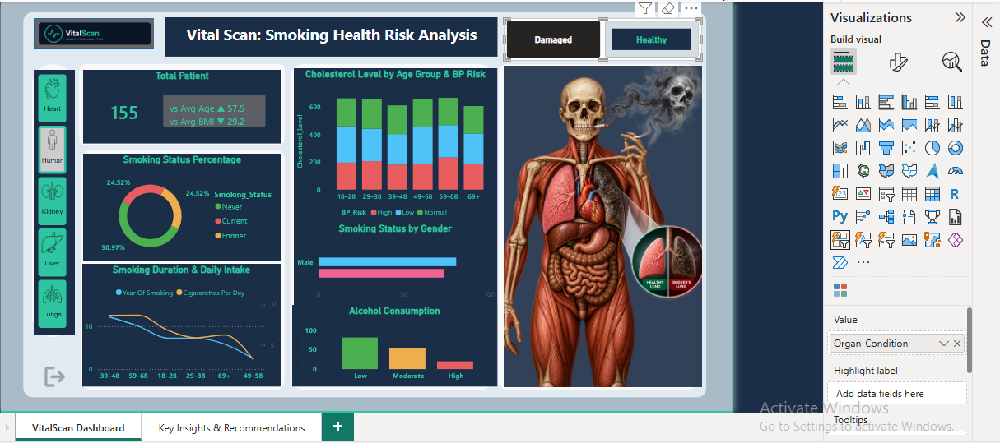
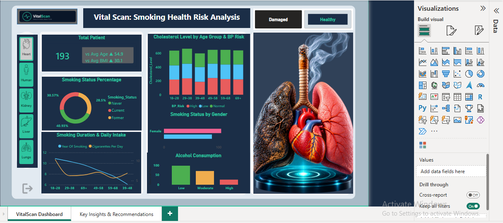
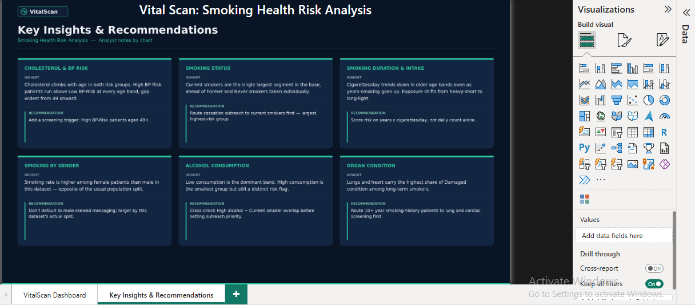

# 🫁 VitalScan: Smoking Health Risk Analysis Dashboard

An end-to-end healthcare analytics project built to identify high-risk patients based on smoking, lifestyle, and clinical risk factors, using SQL, Excel, and Power BI — covering patient demographics, smoking behavior, lifestyle risk, and a custom rule-based risk-scoring model.

---

## 📌 Short Description / Purpose

This project analyzes **2,500 patient records** to understand how smoking behavior, alcohol consumption, and clinical markers (blood pressure risk, cholesterol, family history) relate to organ health outcomes. It combines SQL for data cleaning and business-question analysis, Excel for independent validation and a priority screening output, and Power BI for an interactive 2-page dashboard. The goal is to give a clinic or hospital team a simple, explainable way to flag which patients should be prioritized for screening — without needing a machine learning model.

---

## 🛠️ Tech Stack

- 🗄️ **MySQL Workbench** – Data cleaning, validation checks, business-question queries, and rule-based Risk Score logic
- 📗 **Microsoft Excel** – Independent validation of the SQL output, a separately-built Risk Score (nested `IF`), and a Priority Screening List for handoff
- 📊 **Power BI Desktop** – Main dashboard and visualization platform
- 🧠 **DAX (Data Analysis Expressions)** – Calculated measures and comparison KPIs (Total Patients, Average Age/BMI vs. overall population)
- 📁 **File Format** – `.sql` for queries, `.xlsx` for the Excel workbook, `.png` for dashboard previews

---

## 📂 Data Source

An internal-style patient-level dataset containing **2,500 records**, combining lifestyle self-report fields (smoking status, years of smoking, cigarettes per day, alcohol consumption) with clinical markers (BP risk, cholesterol level, family history of disease) and an organ-condition outcome (Healthy / Damaged) across five organs — Heart, Lungs, Liver, Kidney, and general Human Body.

---

## ✨ Features / Highlights

### 🎯 Business Problem

A clinic or hospital has more patients than it can screen at once. It has patient-level data (smoking history, alcohol use, BP risk, cholesterol, family history) but no simple, explainable way to answer:

- Which patients carry the highest combined lifestyle and clinical risk?
- How should limited screening capacity be prioritized?
- Can a transparent, rule-based score do this without a predictive ML model?

### 🎯 Goal of the Dashboard

To deliver a 2-page interactive Power BI report that:

- Breaks down smoking behavior, cholesterol, BP risk, alcohol use, and organ condition across the patient population
- Introduces a transparent, rule-based Risk Score that ranks patients by known clinical risk factors
- Converts that score into a page of plain-language insights and recommendations for a non-technical reader

### 🖥️ Walkthrough of Key Visuals

**Page 1 — VitalScan Dashboard**
- KPI card: Total Patients, with comparison against overall average Age and BMI
- Donut chart: Smoking status split — 45.4% Never, 29.3% Current, 25.2% Former
- Bar chart: Smoking status by gender
- Column chart: Cholesterol Level by Age Group, colored by BP Risk category
- Line chart: Years of smoking vs. cigarettes per day, by age group
- Column chart: Alcohol consumption split — 49.3% Low, 36.4% Moderate, 14.2% High
- Interactive organ visual: Heart / Lungs / Liver / Kidney / Human Body, filterable by Healthy / Damaged condition — patient count and comparison KPIs update live with the selection

**Page 2 — Key Insights & Recommendations**
- A page summarizing the finding and recommendation for each chart on Page 1, written in plain business language for a non-technical reader (e.g. a clinic administrator)

### 💡 Business Impact & Insights

- **Risk Score segmentation:** A rule-based score (smoking status + BP risk + cholesterol + family history + alcohol use) sorts patients into High / Medium / Low tiers. The High Risk tier (246 patients, 9.8% of the population) is **80.9% current smokers, 59.8% High BP Risk, and 68.3% family-history positive** — compared to just 2.9%, 6.5%, and 10.1% in the Low Risk tier. The score clearly separates patients by known risk factors.
- **Screening-priority framing, not a diagnosis claim:** Organ condition (Healthy/Damaged) in this dataset does not correlate with the risk factors above, so the score is used as a **screening-priority tool** — deciding who gets called in first — rather than a backtested predictor of an existing diagnosis. That is the correct real-world use case: screening happens before diagnosis, not after.
- **Organ-level variation:** Damaged-condition rate ranges from 32.7% (Human Body) to 37.7% (Liver) across the five organs tracked.
- **Cross-tool validation caught a real bug:** Rebuilding the Risk Score independently in Excel initially gave a different High Risk count than SQL. The cause was Excel treating blank cells as zero in comparisons, which silently miscounted patients with missing survey data. Adding an `ISNUMBER` guard fixed it and brought both tools back to an exact match.
- **Actionable handoff:** The Excel workbook's Priority Screening List turns the score directly into a sorted, ready-to-use list of the highest-priority patients for a clinic to act on.

---

## 📸 Screenshots / Demos

**VitalScan Dashboard — Healthy View**


**VitalScan Dashboard — Damaged View**


**Key Insights & Recommendations**


🎥 **Watch the interactive dashboard demo (with live slicer filtering):** [LinkedIn Post Link]

*Note: The Power BI file (.pbix) is not included in this repository, to protect the dashboard design and DAX logic. Screenshots and a video walkthrough are provided instead — feel free to reach out if you'd like to discuss the implementation.*

---

## 📁 Repository Structure

```
vitalscan-health-risk-analysis/
├── README.md
├── Vitalscan_SQL_Cleaning_RiskScoring.sql
├── VitalScan_Analysis.xlsx
└── VitalScan_Dashboard_Screenshots/
    ├── page1_vitalscan_dashboard_healthy.png
    ├── page1_vitalscan_dashboard_damaged.png
    └── page2_key_insights_recommendations.png
```

---

## 🔗 Connect

**Ankit Bijalwan**
If you're working in healthcare analytics and have feedback on this project, I'd love to hear it — feel free to reach out on [LinkedIn](https://www.linkedin.com/in/bijalwanankit).
